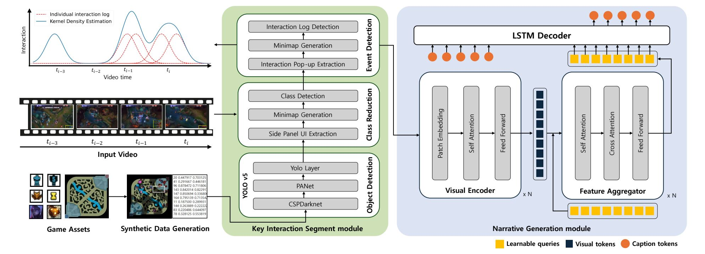








# About Me

I am a Postdoctoral Research Fellow at [IBS](https://www.ibs.re.kr) (Institute for Basic Science) [BIMAG](https://www.ibs.re.kr/bimag) (Biomedical Mathematics Group), led by Prof. [Jae Kyoung Kim](http://mathsci.kaist.ac.kr/~jaekkim/). I received the B.S. and B.L.S degree in Computer Science and Language Technology from [HUFS](https://www.hufs.ac.kr) (Hankuk University of Foreign Studies), South Korea, in 2021, and the Ph.D. degree in Mathematics from the Graduate School, HUFS, in 2025. Since 2025, I have been a Postdoctoral Research Fellow with IBS BIMAG, South Korea. My research interests include data analysis, deep learning, artificial intelligence, natural language processing, computer vision, and homomorphic encryption.
 
 

<!-- # News
- *2025*, Featured in UST Story: [Development of generative AI-based E-sports service automation platform technology](https://blog.naver.com/uststory/224163085962?trackingCode=rss)
 
 
 -->

# Educations

- *Mar. 2021 - Feb. 2025*, Ph.D. (Doctor of Philosophy) in Mathematics, Hankuk University of Foreign Studies. Thesis: Mathematical Modeling and Algorithmic Optimization in Machine Learning: Peer Reviewer Recommendation,  Metro Timetable Optimization, Agricultural Commodity Price Prediction, and Super-Resolution (Advisor: Prof. Young Rock Kim)
- *Mar. 2017 - Feb. 2021*, B.S. (Bachelor of Science) in Computer Engineering, Hankuk University of Foreign Studies. Thesis: Article Writing Advisor System based on Korean Corpus with GPT-2 Language Model (Advisor : Prof. Nak Hyun Kim)
- *Mar. 2017 - Feb. 2021*, B.L.S. (Bachelor of Language Science) in Language and Technology, Hankuk University of Foreign Studies. (Advisor : Prof. Jeong-sik Park)
 
 

# Research Experience

- *May. 2025 - Feb. 2027[\*](#footnote_1)*, Postdoctoral Research Fellow. BIMAG, IBS (Advisor: Prof. Jae Kyoung Kim).

- *Mar. 2021 - Feb. 2025*, Research Assistant. KYR Lab, HUFS (Advisor: Prof. Young Rock Kim).

- *Sep. 2023 - Aug. 2024*, Research Intern. Data Analytics Team, [NIMS](https://www.nims.re.kr) (National Institute for Mathematical Sciences) (Advisor: Ph.D. Yunkyong Hyon).

- *Jul. 2019 - Feb. 2021*, Undergraduate Research Assistant. KYR Lab, HUFS (Advisor: Prof. Young Rock Kim).

    <a name="footnote_1">\*</a>: Expected.
   
   

# Publications

## Journal Articles

IEEE Trans. Intell. Transp. Syst.

[Optimizing Extended Metro Timetables During Year-End Events Using Graph Neural Networks: A Study on Passenger Flow Prediction and Timetable Optimization](https://ieeexplore.ieee.org/abstract/document/11047236)

**Hyun, Jinwoo** and Joe, Hyungjun and Lee, Cheyoung and Kim, Young Rock and Min, Youngho

IEEE Transactions on Intelligent Transportation Systems

[**Paper**](https://ieeexplore.ieee.org/abstract/document/11047236), [**Project**](https://github.com/KYRLAB/Optimizing-Extended-Metro-Timetables)

Sci. Rep.

[RNN and GNN based prediction of agricultural prices with multivariate time series and its short-term fluctuations smoothing effect](https://www.nature.com/articles/s41598-025-97724-7)

Min, Youngho and Kim, Young Rock and Hyon, YunKyong and Ha, Taeyoung and Lee, Sunju and Hyun, Jinwoo[&dagger;](#footnote_2) and Lee, Mi Ra

Scientific Reports

[**Paper**](https://www.nature.com/articles/s41598-025-97724-7)

J. Algebra Appl.

[Fully homomorphic encryption scheme and Fermat’s little theorem](https://www.worldscientific.com/doi/abs/10.1142/S0219498824500713?srsltid=AfmBOopCxXjKNg3k-e92OLP6IF4vvno9J9DlgNxQW9KoQHFcvlHkQ8Mp)

Chun, Samgu and Choi, Wonseok and **Hyun, Jinwoo** and Kang, SeokJin and Kim, Hyoung Joong and Kim, YoungRock

Journal of Algebra and Its Applications

[**Paper**](https://www.worldscientific.com/doi/abs/10.1142/S0219498824500713?srsltid=AfmBOopCxXjKNg3k-e92OLP6IF4vvno9J9DlgNxQW9KoQHFcvlHkQ8Mp)

IEEE Acc.

[An Algorithm for Peer Reviewer Recommendation Based on Scholarly Activity Assessment](https://www.worldscientific.com/doi/abs/10.1142/S0219498824500713?srsltid=AfmBOopCxXjKNg3k-e92OLP6IF4vvno9J9DlgNxQW9KoQHFcvlHkQ8Mp)

Choi, DongHoon and **Hyun, Jinwoo** and Kim, YoungRock

IEEE Access

[**Paper**](https://www.worldscientific.com/doi/abs/10.1142/S0219498824500713?srsltid=AfmBOopCxXjKNg3k-e92OLP6IF4vvno9J9DlgNxQW9KoQHFcvlHkQ8Mp), [**Project**](https://github.com/KYRLAB/An-Algorithm-for-Peer-Reviewer-Recommendation-based-on-Scholarly-Activity-Assessment)

## Peer-reviewed Conference Proceedings

## Submitted Papers

 <a name="footnote_2">&dagger;</a>: Corresponding author.
 

# Patents

## International
- Method And Apparatus for Generating E-Sports Match Highlight Commentary Based on Multimodal Video Captioning (U.S.A.) - Pending

## Domestic
- Method And Apparatus for Generating E-Sports Match Highlight Commentary Based on Multimodal Video Captioning, Application 

No. 10-2025-0157168

 
 

# Technology Transfer
- Generative AI-based eSports service automation technology
 
 

# Software Registration
- Narration Generation Software for Esports Game Videos
 
 

# Projects
- *2024.07 - 2026.12*, Development of generative AI-based E-sports service automation platform technology to improve E-sports operation efficiency.
 
 

# Honors and Awards
- *2025*, National Strategic Technology Excellence Scholarship.
- *2021*, Grand Prize, Hankuk University of Foreign Studies 4th Company Analysis Creative Proposal Contest.
  - Presented KOICA's strategy to build a platform for development cooperation in the Vietnamese film industry.
- *2019*, Grand Prize, Hankuk University of Foreign Studies 6th Better World Idea Workshop.
  - Presented an idea for a generation convergence radio under the theme of "Convergence of Culture and Science and Technology."
   
   

