






# About Me

I am a Postdoctoral Research Fellow at [IBS](https://www.ibs.re.kr) (Institute for Basic Science) [BIMAG](https://www.ibs.re.kr/bimag) (Biomedical Mathematics Group), led by Prof. [Jae Kyoung Kim](http://mathsci.kaist.ac.kr/~jaekkim/). I received the B.S. (Bachelor of Science) and B.L.S (Bachelor of Language Science) degree in Computer Science and Language Technology from [HUFS](https://www.hufs.ac.kr) (Hankuk University of Foreign Studies), South Korea, in 2021, and the Ph.D. (Doctor of Philosophy) degree in Mathematics from the Graduate School, HUFS, in 2025. Since 2025, I have been a Postdoctoral Research Fellow with IBS BIMAG, South Korea. My research interests include data analysis, deep learning, artificial intelligence, natural language processing, computer vision, and homomorphic encryption.
 
 

<!-- # News
- *2025*, Featured in UST Story: [Development of generative AI-based E-sports service automation platform technology](https://blog.naver.com/uststory/224163085962?trackingCode=rss)
 
 
 -->

# Educations

- *Mar. 2021 - Feb. 2025*, Ph.D. in Mathematics, Hankuk University of Foreign Studies. Thesis: Mathematical Modeling and Algorithmic Optimization in Machine Learning: Peer Reviewer Recommendation,  Metro Timetable Optimization, Agricultural Commodity Price Prediction, and Super-Resolution (Advisor: Prof. Young Rock Kim)
- *Mar. 2017 - Feb. 2021*, B.S. in Computer Engineering, Hankuk University of Foreign Studies. Thesis: Article Writing Advisor System based on Korean Corpus with GPT-2 Language Model (Advisor : Prof. Nak Hyun Kim)
- *Mar. 2017 - Feb. 2021*, B.L.S. in Language and Technology, Hankuk University of Foreign Studies. (Advisor : Prof. Jeong-sik Park)
 
 

# Research Experience

- *May. 2025 - Feb. 2027[\*](#footnote_1)*, Postdoctoral Research Fellow. BIMAG, IBS (Advisor: Prof. Jae Kyoung Kim).

- *Mar. 2021 - Feb. 2025*, Research Assistant. [KYR Lab](https://app.rndcircle.io/lab/762e666d-4612-4cf5-8765-31c73293a027), HUFS (Advisor: Prof. Young Rock Kim).

- *Sep. 2023 - Aug. 2024*, Research Intern. Data Analytics Team, [NIMS](https://www.nims.re.kr) (National Institute for Mathematical Sciences) (Advisor: Ph.D. Yunkyong Hyon).

- *Jul. 2019 - Feb. 2021*, Undergraduate Research Assistant. KYR Lab, HUFS (Advisor: Prof. Young Rock Kim).

    <a name="footnote_1">\*</a>: Expected.
   
   

# Publications

## Journal Articles

IEEE Trans. Intell. Transp. Syst.
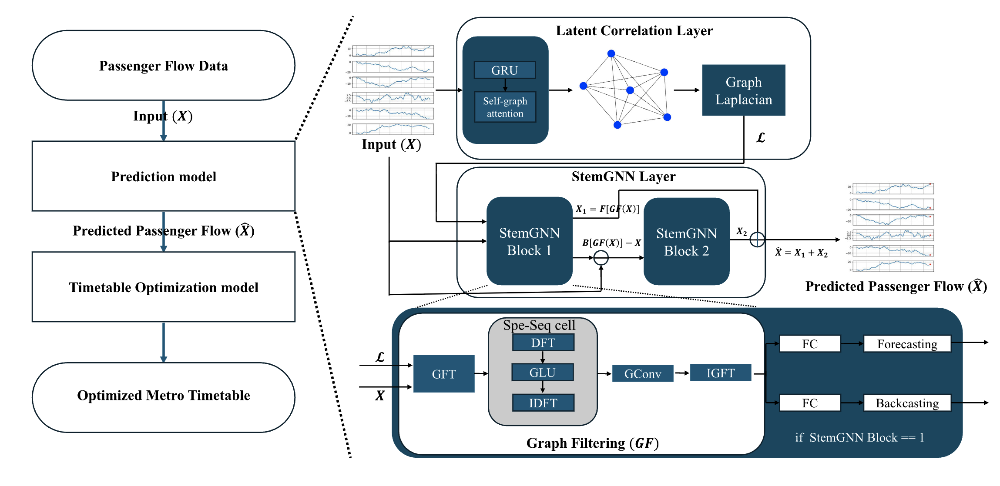

[Optimizing Extended Metro Timetables During Year-End Events Using Graph Neural Networks: A Study on Passenger Flow Prediction and Timetable Optimization](https://ieeexplore.ieee.org/abstract/document/11047236)

**Hyun, Jinwoo** and Joe, Hyungjun and Lee, Cheyoung and Kim, Young Rock and Min, Youngho

IEEE Transactions on Intelligent Transportation Systems

[**Paper**](https://ieeexplore.ieee.org/abstract/document/11047236), [**Project**](https://github.com/KYRLAB/Optimizing-Extended-Metro-Timetables)

Sci. Rep.
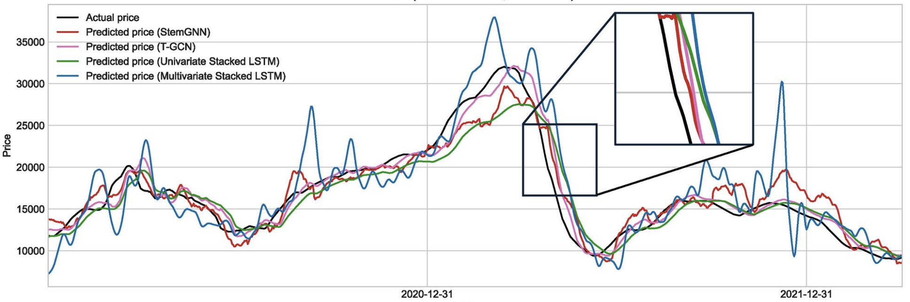

[RNN and GNN based prediction of agricultural prices with multivariate time series and its short-term fluctuations smoothing effect](https://www.nature.com/articles/s41598-025-97724-7)

Min, Youngho and Kim, Young Rock and Hyon, YunKyong and Ha, Taeyoung and Lee, Sunju and **Hyun, Jinwoo[&dagger;](#footnote_2)** and Lee, Mi Ra

Scientific Reports

[**Paper**](https://www.nature.com/articles/s41598-025-97724-7)

J. Algebra Appl.
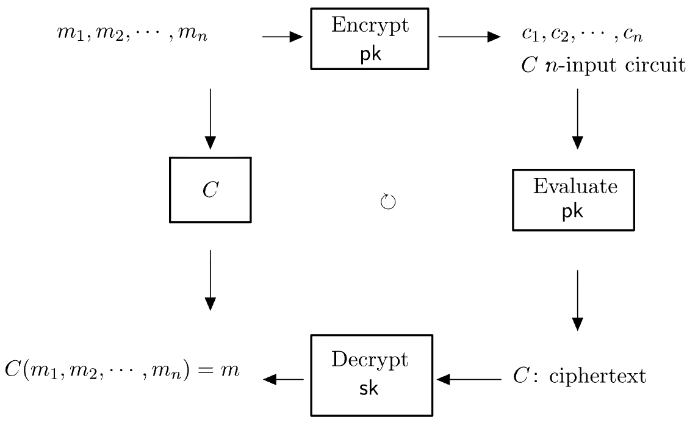

[Fully homomorphic encryption scheme and Fermat’s little theorem](https://www.worldscientific.com/doi/abs/10.1142/S0219498824500713?srsltid=AfmBOopCxXjKNg3k-e92OLP6IF4vvno9J9DlgNxQW9KoQHFcvlHkQ8Mp)

Chun, Samgu and Choi, Wonseok and **Hyun, Jinwoo** and Kang, SeokJin and Kim, Hyoung Joong and Kim, YoungRock

Journal of Algebra and Its Applications

[**Paper**](https://www.worldscientific.com/doi/abs/10.1142/S0219498824500713?srsltid=AfmBOopCxXjKNg3k-e92OLP6IF4vvno9J9DlgNxQW9KoQHFcvlHkQ8Mp)

IEEE Acc.
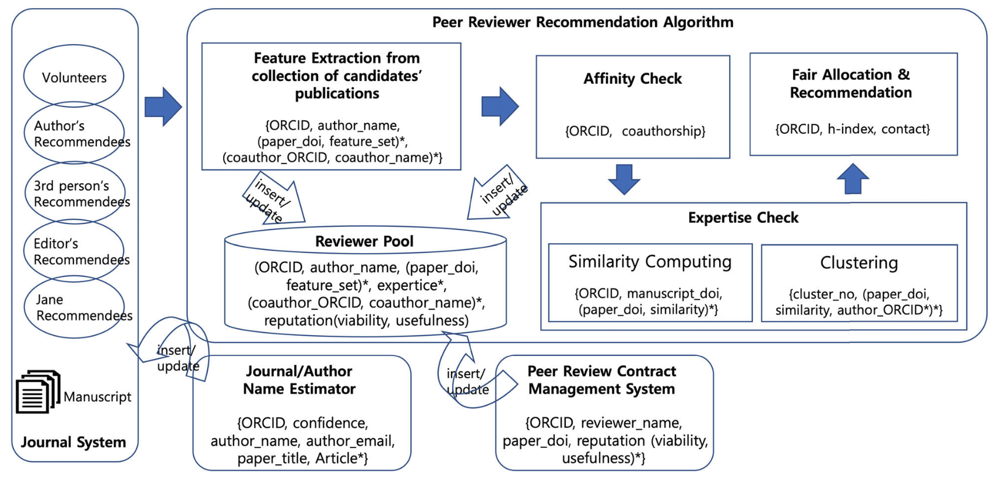

[An Algorithm for Peer Reviewer Recommendation Based on Scholarly Activity Assessment](https://ieeexplore.ieee.org/abstract/document/10091109)

Choi, DongHoon and **Hyun, Jinwoo** and Kim, YoungRock

IEEE Access

[**Paper**](https://ieeexplore.ieee.org/abstract/document/10091109), [**Project**](https://github.com/KYRLAB/An-Algorithm-for-Peer-Reviewer-Recommendation-based-on-Scholarly-Activity-Assessment)

## Peer-reviewed Conference Proceedings

ACM MMSports 2025
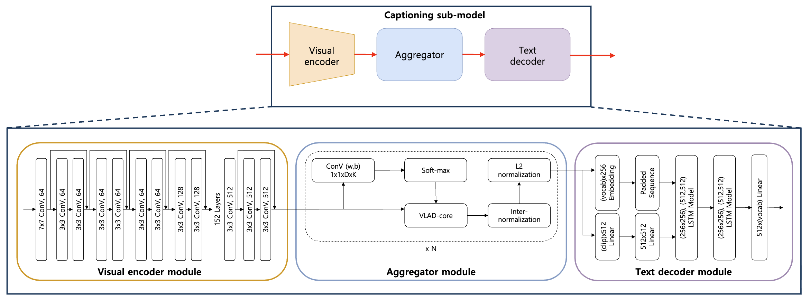

[Single-anchored Multi-modal Dense Video Captioning for Esports Broadcasts Commentaries](https://dl.acm.org/doi/10.1145/3728423.3759412)

Yu, Ari and **Hyun, Jinwoo** and Jang, Hyeong-Gyu and Park, Sung-Yun and Lee, Sang-Kwang

Proceedings of the 8th International ACM Workshop on Multimedia Content Analysis in Sports (Oral)

[**Paper**](https://dl.acm.org/doi/10.1145/3728423.3759412)

NeurIPS 2024 Workshop
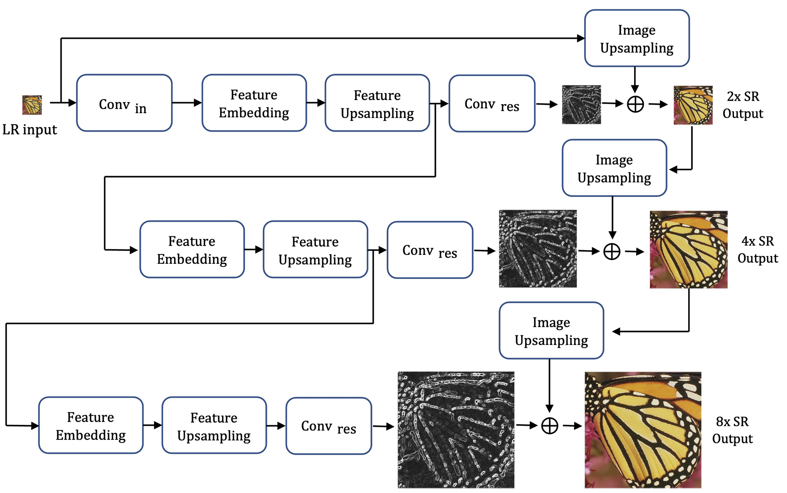

[Weight-Sharing Method for Upsampling Layer from Feature Embedding Recursive Block](https://neurips.cc/virtual/2024/98235)

**Hyun, Jinwoo** and Hyon, YunKyong and Lee, Mira and Lee, Sunju and Ha, Taeyoung and Kim, YoungRock

Workshop on Machine Learning and Compression, NeurIPS 2024 (Poster)

[**Paper**](https://neurips.cc/virtual/2024/98235)

## Submitted Papers
- 

 
 

# Presentations

## Talks
- 

## Posters

- *Dec. 2025*, Robust Trend Filtering in Wearable Sleep Biosignals via Periodic Activation Neural Networks, *KAI-X Global Conference in Sleep Synergy* (Daejeon, Korea).

- *Nov. 2025*, Neural Network Architecture for Trend Filtering in Periodic Signal Data, *The Korean Society for Industrial and Applied Mathematics 2025 Annual Meeting* (Gyeongju, Korea).

- *Dec. 2024*, Weight-Sharing Method for Upsampling Layer from Feature Embedding Layer, *NeurIPS 2024 Workshop Compression* (Vancouver, Canada).

 
 

# Academic Project

- *May. 2025 - Feb. 2027[\*](#footnote_1)*, Multiscale dynamics in biosciences and medicine, IBS.

- *Nov. 2021 - Feb. 2025*, Research on tropical geometry and crystals in representation theory, HUFS.

- *Sep. 2023 - Aug. 2024*, Artificial Intelligence-type Modeling for Industrial and Medical Areas using Computational Mathematical Sciences, NIMS.

- *Oct. 2019 - Oct. 2020*, Development of a Blockchain Application Platform for Open Peer Review to Improve Trustworthiness and Transparency for Scholarly Publishing, KISTI (Korea Institute of Science and Technology Information).

 
 

# Fellowships and Awards

- *Feb. 2024*, Outstanding Research Laboratory Award

- *Aug. 2023*, [University Innovation] Scholarship for Global Talent Development

- *Feb. 2023*, Department Assistantship Scholarship

- *Feb. 2023*, [University Innovation] Scholarship for Global Talent Development

- *Aug. 2022*, [University Innovation] Scholarship for Global Talent Development

- *Aug. 2022*, [BK21] Scholarship for Graduate student (RA)

- *Feb. 2022*, [University Innovation] Scholarship for Global Talent Development

- *Aug. 2021*, Scholarship for Academic Excellence

- *Aug. 2021*, [University Innovation] Scholarship for Global Talent Development

- *Aug. 2021*, [BK21] Scholarship for Graduate student (RA)

- *Feb. 2021*, [University Innovation] Scholarship for Global Talent Development

 
 

# Certifications

## Data analytics

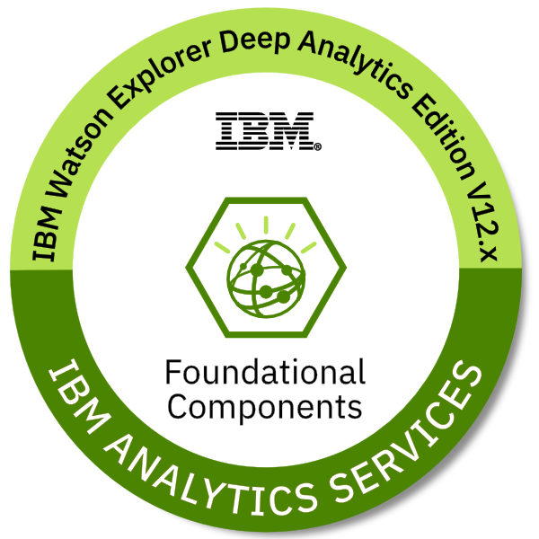

[IBM Watson Explorer Deep Analytics Edition Foundational Components](https://www.credly.com/badges/b3a55ddf-c2f1-41de-ad4e-a20473aad7aa?source=linked_in_profile)

Issued by [IBM](https://www.credly.com/org/ibm)

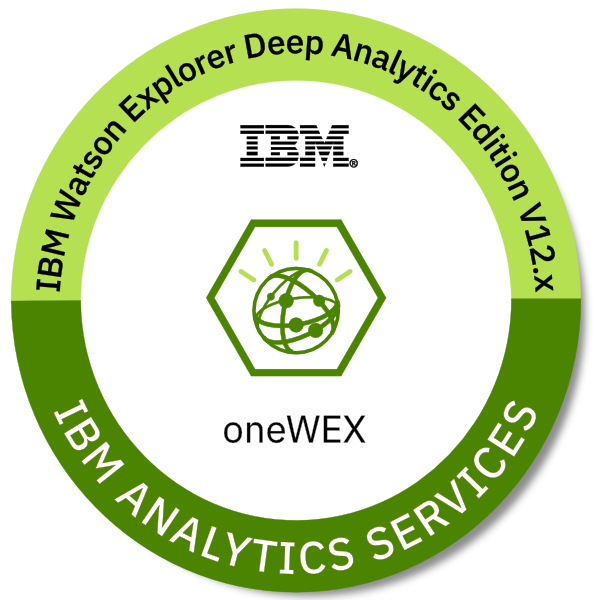

[IBM Watson Explorer Deep Analytics Edition oneWEX](https://www.credly.com/badges/cc62d3b5-034f-410e-a9d6-7b1257fb6f0b?source=linked_in_profile)

Issued by [IBM](https://www.credly.com/org/ibm)

## Computer engineering

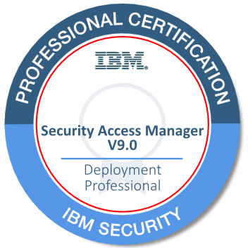

[IBM Certified Deployment Professional - Security Access Manager](https://www.credly.com/badges/7169fb6d-dc05-424f-8d27-aedda4e75a7e?source=linked_in_profile)

Issued by [IBM](https://www.credly.com/org/ibm)

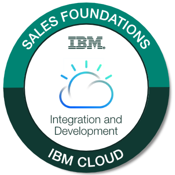

[Sales Foundations for IBM Security Mastery Professional](https://www.credly.com/badges/39da7a82-5454-464e-843b-c03042b8ea46?source=linked_in_profile)

Issued by [IBM](https://www.credly.com/org/ibm)

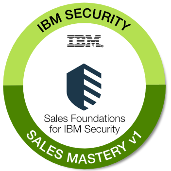

[IBM Cloud Integration Sales Foundations](https://www.credly.com/badges/05dbfdba-8577-4ecc-8b1c-3e8cd8a47a9b?source=linked_in_profile)

Issued by [IBM](https://www.credly.com/org/ibm)

## Database system

[IBM Db2 Hosted Cloud Administration](https://www.credly.com/badges/57876592-8151-422b-b4bf-43fe42574ccc?source=linked_in_profile)

Issued by [IBM](https://www.credly.com/org/ibm)

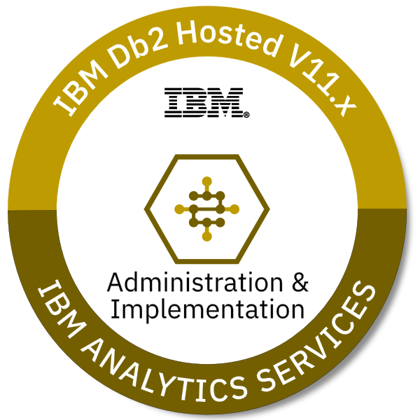

[IBM Db2 Hosted Cloud Administration and Implementation Essentials](https://www.credly.com/badges/0bff43a1-e35a-4202-8a46-95f2a541b2ec?source=linked_in_profile)

Issued by [IBM](https://www.credly.com/org/ibm)

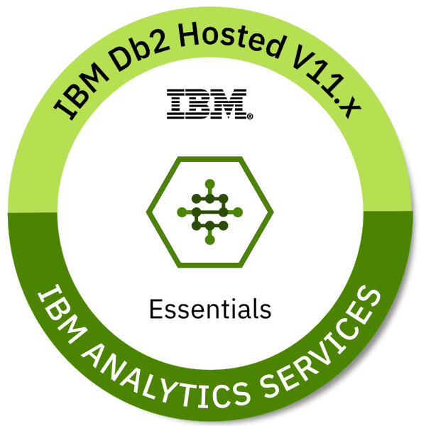

[IBM Db2 Hosted Essentials](https://www.credly.com/badges/5089d6f8-490a-467c-8a52-d164813e2de0?source=linked_in_profile)

Issued by [IBM](https://www.credly.com/org/ibm)

 
 

# Volunteers

- *Jul. 2017 - Aug. 2017*, World Friends Korea IT Volunteer Program (Mongolia), NIA (National Information Society Agency).

 
 

# Other Experience

- *Sep. 2020 - Oct. 2021*, Researcher, R&D Center, SPELIX Inc.

- *Jan. 2020 - Aug. 2020*, Research Intern, R&D Center, SPELIX Inc.

 
 

<a name="footnote_1">\*</a>: Expected.
<a name="footnote_2">&dagger;</a>: Corresponding author.

